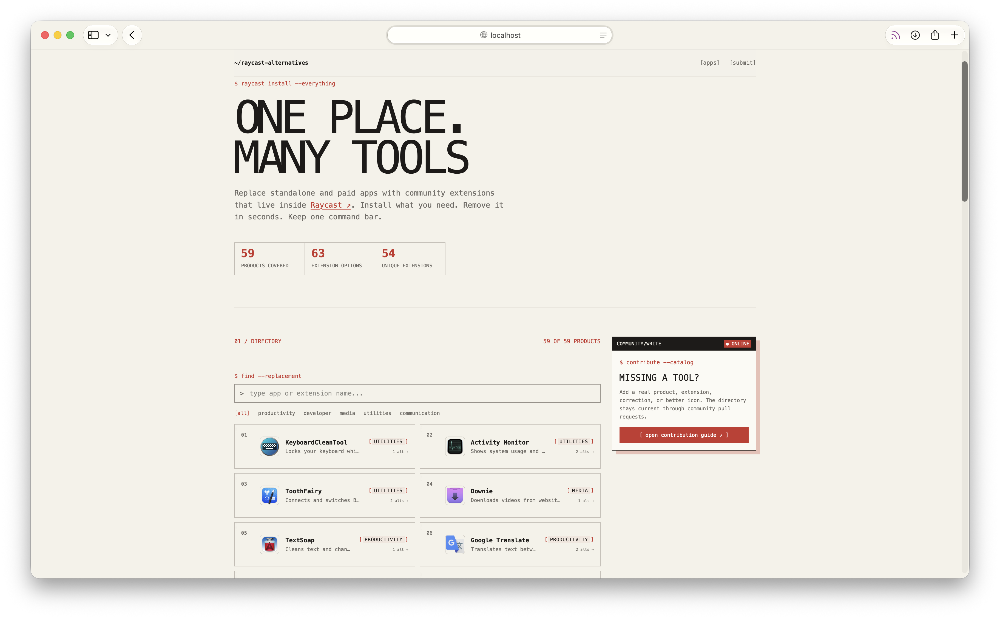

# Raycast Alternatives

An open directory of Raycast extensions that replace standalone and paid macOS apps.

Raycast keeps many useful tools inside one command bar. This project makes those alternatives easy to discover without installing, updating, and paying for a separate app for every small task. The catalog is community-maintained through pull requests.

## Preview



## Add a product

Products are standalone applications people may want to replace. Add an object to `data/apps.json`:

```json
{
  "id": "example-app",
  "name": "Example App",
  "url": "https://example.com/",
  "iconUrl": "https://example.com/icon.png",
  "category": "utilities",
  "description": "Short description of the standalone product."
}
```

Use a stable official website or App Store URL. `iconUrl` must point to a working square image. Available categories: `productivity`, `developer`, `media`, `utilities`, `communication`.

## Add a Raycast extension

Add an object to `data/extensions.json`:

```json
{
  "id": "example-extension",
  "name": "Example Extension",
  "description": "What the extension does inside Raycast.",
  "url": "https://www.raycast.com/author/example-extension",
  "replaces": ["example-app"]
}
```

`replaces` contains IDs from `data/apps.json`. One extension may replace several products; one product may have several alternatives.

No manual fallback icon is needed. If an image cannot load, the UI uses the first letter of the product or extension name.

Only submit real, currently available projects. Dead pages, placeholders, abandoned downloads, and broken icons are not accepted.
